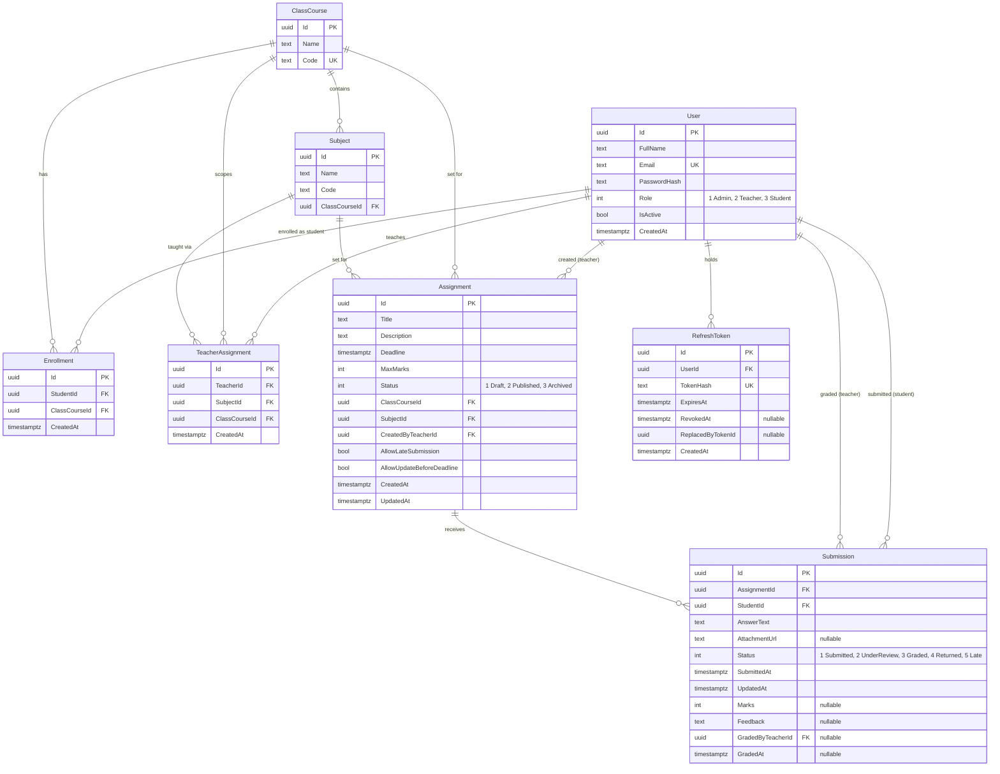

<!--
Copyright (c) 2026 Rakib Hassan. Submitted for candidacy evaluation only.
Not licensed for production or commercial use. See LICENSE. sig:a24a5edb253940aa
-->

# Entity Relationship Diagram

Generated from the EF Core model in `AssignmentSystem.Infrastructure/Persistence`. The
schema is created by the `Initial` migration — there is no manual SQL step.

## Diagram

## Unique constraints

| Table | Columns | Why |
|---|---|---|
| `Users` | `Email` | Login identifier |
| `ClassCourses` | `Code` | Human-facing class code |
| `Enrollments` | `StudentId, ClassCourseId` | A student joins a class once |
| `TeacherAssignments` | `TeacherId, SubjectId, ClassCourseId` | One allocation per teacher/subject/class |
| `Submissions` | **`AssignmentId, StudentId`** | **Business rule 6** — one submission per student per assignment |
| `RefreshTokens` | `TokenHash` | Token lookup on refresh |

The `Submissions` index is doing real work, not just describing intent. The service checks
for an existing submission before inserting, but between that check and the insert two
concurrent requests can both see "none exists". The index is what makes the second one fail.

## Other indexes

Every foreign key is indexed. Two composite indexes match the queries the business rules
actually issue:

- `Assignments (Status, ClassCourseId)` — the student-facing query is always "Published
  assignments for the classes I am enrolled in" (rules 1 and 2).
- `TeacherAssignments (TeacherId, SubjectId, ClassCourseId)` — the rule 3 lookup on every
  assignment create.

## Check constraints

| Constraint | Definition |
|---|---|
| `CK_Assignments_MaxMarks_Positive` | `"MaxMarks" > 0` |
| `CK_Submissions_Marks_NonNegative` | `"Marks" IS NULL OR "Marks" >= 0` |

### Why the marks upper bound is not a check constraint

The build plan specifies `Marks IS NULL OR (Marks >= 0 AND Marks <= <maxMarks>)`.

Only the lower half of that is expressible as a `CHECK`. `MaxMarks` lives on `Assignments`,
and a PostgreSQL check constraint cannot reference a column in another table — it is
evaluated per row, against that row alone. Enforcing it at the database level would need a
trigger, which is more machinery than this earns.

So the bound is split:

- **Database** — `Marks >= 0`, as a real constraint
- **Service layer** — `Marks <= Assignment.MaxMarks`, raising `MarksExceedMaxException` → **422**

The build plan already calls for the service-layer check, so nothing is lost; the
difference is that the upper bound is enforced in exactly one place rather than two.
Covered by `Grade_With_Marks_Above_MaxMarks_Returns_422` and the boundary case
`Grade_With_Marks_Equal_To_MaxMarks_Succeeds`.

## Delete behaviour

`Restrict` almost everywhere. Deleting a user, class or subject that still has dependent
rows is refused by the database and surfaced as a `409` rather than silently destroying
graded work. Two deliberate exceptions:

- `Assignment → Submission` cascades: deleting an assignment should take its submissions.
- `User → RefreshToken` cascades: tokens are worthless without their user and carry no
  audit value.

Users are deactivated (`IsActive = false`) rather than deleted, so their authored
assignments and graded submissions keep their references intact.

## Timestamps

Every timestamp column is `timestamptz` and every value is UTC. `AppDbContext` applies a
value converter to all `DateTime` properties in the model, which serves two purposes:
Npgsql throws when a non-UTC `DateTime` is written to `timestamptz`, and values that never
round-tripped through the database would otherwise carry `DateTimeKind.Unspecified` — which
is how a deadline comparison silently ends up comparing local time against UTC.

## Deviation from the specified model

`RefreshToken` is not in the original data model. It was added because refresh tokens must
be stored and rotated: without server-side state, rotation is cosmetic and a stolen token
cannot be revoked. Only a SHA-256 hash of each token is persisted, for the same reason
passwords are hashed.
